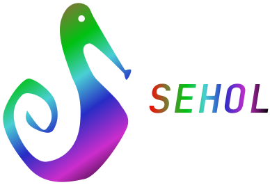

<div align="center">
  
</div>

<h3 align="center">Sea Horse Language</h3>
<p align="center">Linguagem de programação compilada com foco em simplicidade e praticidade.</p>

## Introdução

- Sehol foi criado para:
  - Integrar a facilidade das linguagens web para o desenvolvimento nativo.
  - Integrar uma curva mais facil de aprendizado usando conceitos já conhecidos.
  - Aproveitar da perfomance das linguagens compiladas em um código simples.

## Utilizando o Sehol
O código neste repositório implementa um compilador simples para a linguagem Sehol em C++.

Infelizmente o compilador ainda não está terminado e muito menos em estabilidade. Portanto, não recomendo a você tentar executar qualquer código que esteja nesse repositório **por enquanto**.

## Exemplos
- Hello World:
  ```
  printLog("Hello World!");
  ```
- Variaveis:
  ```
  var i = "hello";
  printLog(i);
  ```
- I/O:
  ```
  var i = input("Digite seu nome:");
  printLog(i);
  ```

Mais exemplos estão por vir...

---

> [MIT License](./LICENSE)
